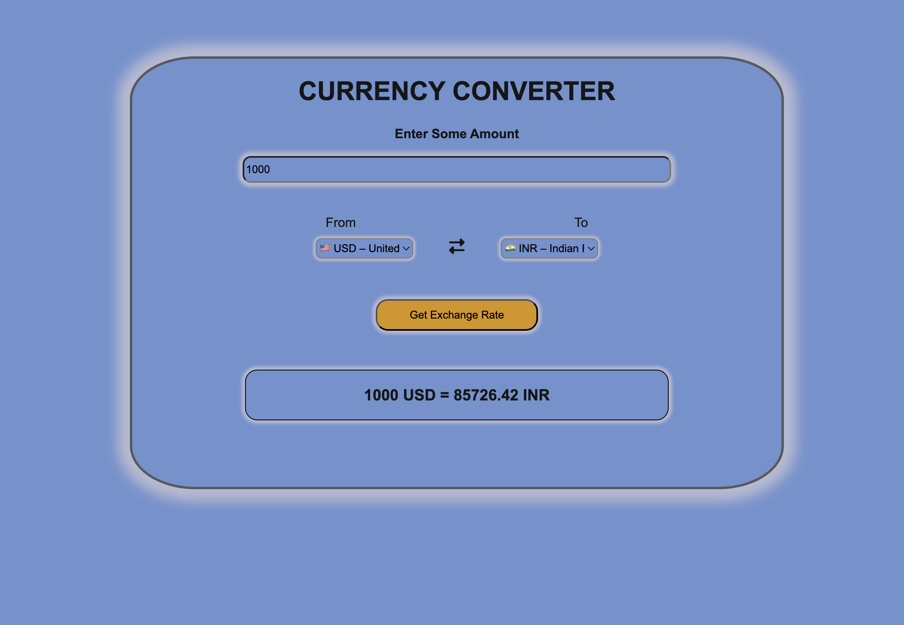

# 💱 Currency Converter

A simple web-based currency converter that fetches real-time exchange rates using the [Open Exchange Rates API](https://open.er-api.com/v6/latest/USD).

## 🌐 Live Demo

[👉 View it on GitHub Pages](https://yogeshnaru.github.io/Currency-converter/)

## 📦 Features

- Convert between 170+ world currencies
- Real-time exchange rates using a public API
- Clear error handling and input validation

## 🚀 How to Use

1. Enter the amount you want to convert.
2. Choose the "From" and "To" currencies.
3. Click the **Convert** button to see the result.

## 🛠️ Technologies Used

- HTML
- CSS (responsive layout)
- JavaScript (fetch API)

## 🖼️ Screenshot

